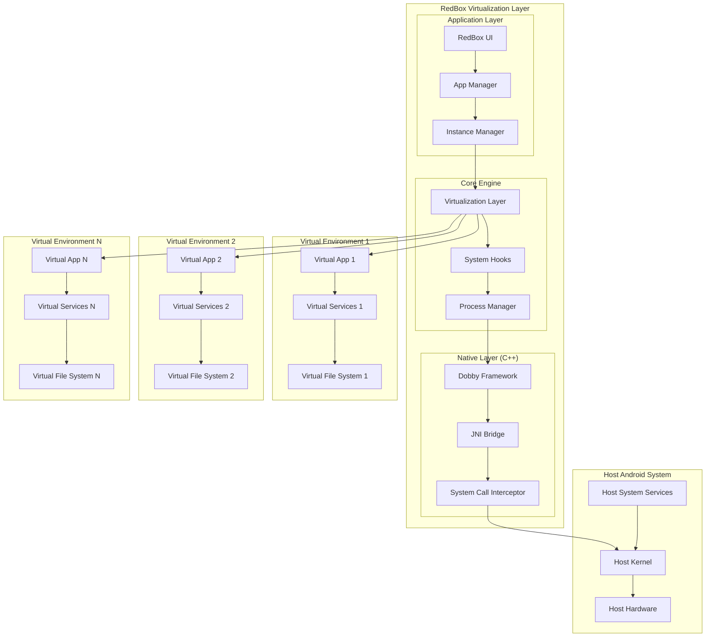
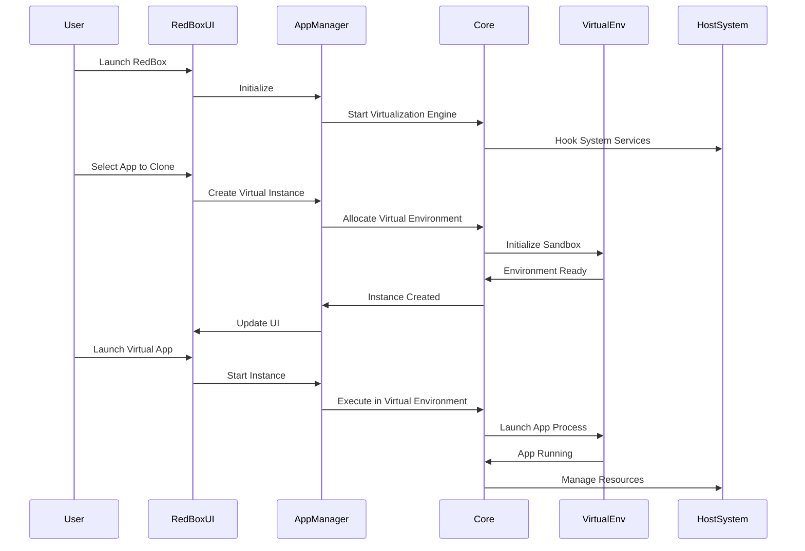

# RedBox Architecture Overview

## System Architecture Diagram

```mermaid
graph TB
    subgraph "Host Android System"
        HS[Host System Services]
        HK[Host Kernel]
        HD[Host Hardware]
    end
    
    subgraph "RedBox Virtualization Layer"
        subgraph "Application Layer"
            UI[RedBox UI]
            AM[App Manager]
            IM[Instance Manager]
        end
        
        subgraph "Core Engine"
            VL[Virtualization Layer]
            SH[System Hooks]
            PM[Process Manager]
        end
        
        subgraph "Native Layer (C++)"
            DF[Dobby Framework]
            JB[JNI Bridge]
            SC[System Call Interceptor]
        end
    end
    
    subgraph "Virtual Environment 1"
        VA1[Virtual App 1]
        VS1[Virtual Services 1]
        VF1[Virtual File System 1]
    end
    
    subgraph "Virtual Environment 2"
        VA2[Virtual App 2]
        VS2[Virtual Services 2]
        VF2[Virtual File System 2]
    end
    
    subgraph "Virtual Environment N"
        VAN[Virtual App N]
        VSN[Virtual Services N]
        VFN[Virtual File System N]
    end
    
    UI --> AM
    AM --> IM
    IM --> VL
    VL --> SH
    SH --> PM
    PM --> DF
    DF --> JB
    JB --> SC
    SC --> HK
    
    VL --> VA1
    VL --> VA2
    VL --> VAN
    
    VA1 --> VS1
    VA2 --> VS2
    VAN --> VSN
    
    VS1 --> VF1
    VS2 --> VF2
    VSN --> VFN
    
    HK --> HD
    HS --> HK
```

## Component Interaction Flow

```mermaid
sequenceDiagram
    participant User
    participant RedBoxUI
    participant AppManager
    participant Core
    participant VirtualEnv
    participant HostSystem
    
    User->>RedBoxUI: Launch RedBox
    RedBoxUI->>AppManager: Initialize
    AppManager->>Core: Start Virtualization Engine
    Core->>HostSystem: Hook System Services
    
    User->>RedBoxUI: Select App to Clone
    RedBoxUI->>AppManager: Create Virtual Instance
    AppManager->>Core: Allocate Virtual Environment
    Core->>VirtualEnv: Initialize Sandbox
    VirtualEnv->>Core: Environment Ready
    Core->>AppManager: Instance Created
    AppManager->>RedBoxUI: Update UI
    
    User->>RedBoxUI: Launch Virtual App
    RedBoxUI->>AppManager: Start Instance
    AppManager->>Core: Execute in Virtual Environment
    Core->>VirtualEnv: Launch App Process
    VirtualEnv->>Core: App Running
    Core->>HostSystem: Manage Resources
```