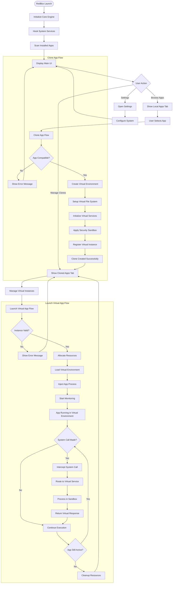
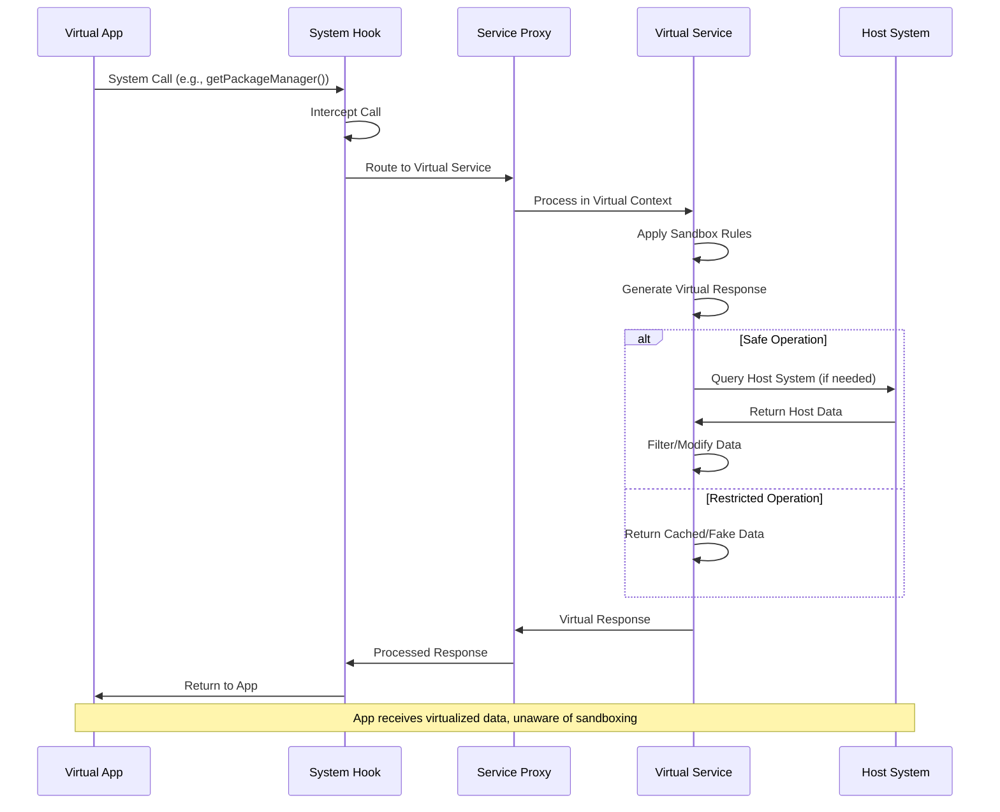
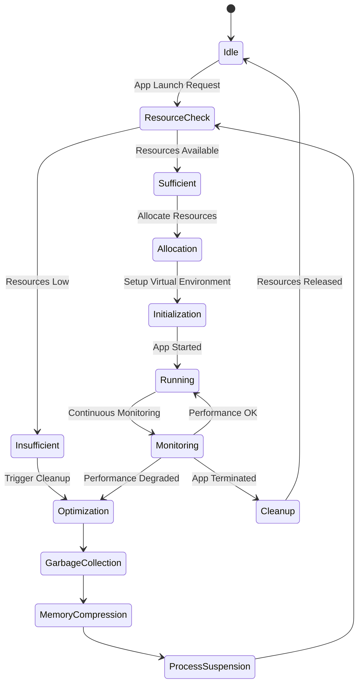
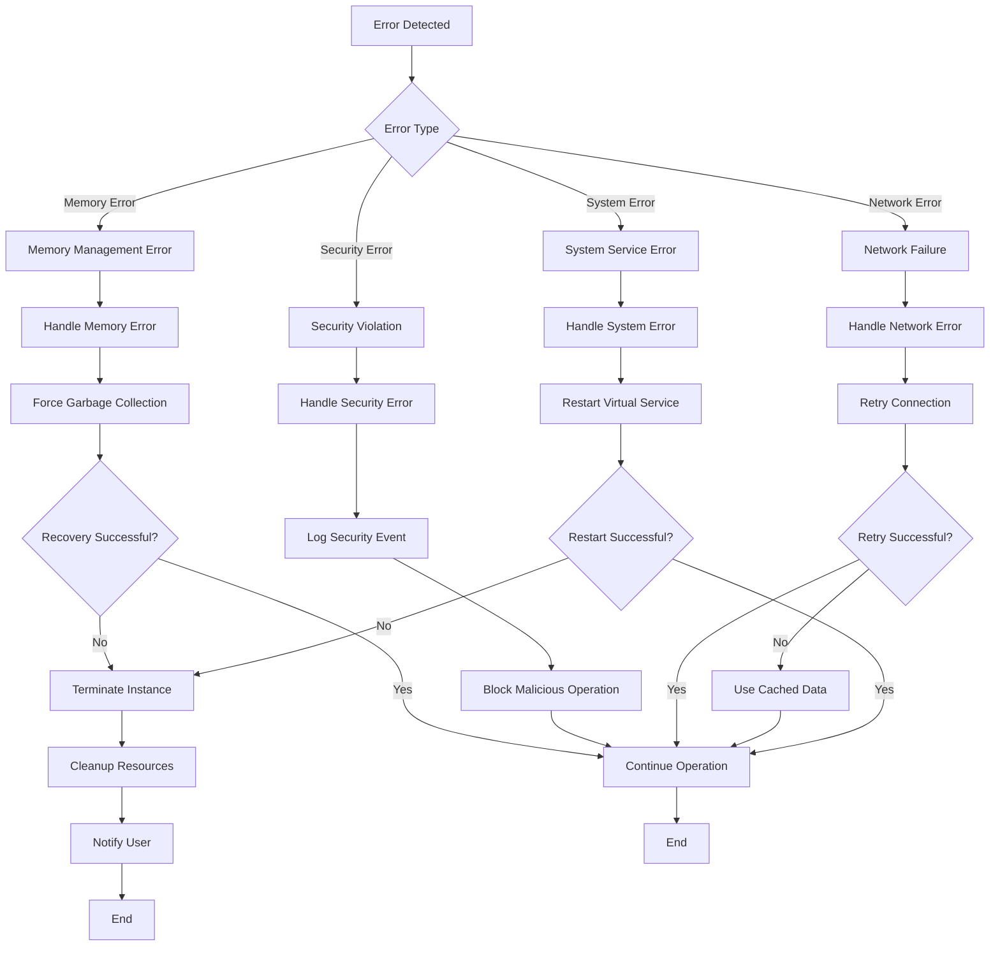

# RedBox Function Flow Chart

## Complete System Function Flow

```mermaid
flowchart TD
    START([RedBox Launch]) --> INIT[Initialize Core Engine]
    INIT --> HOOK[Hook System Services]
    HOOK --> SCAN[Scan Installed Apps]
    SCAN --> UI[Display Main UI]
    
    UI --> CHOICE{User Action}
    
    CHOICE -->|Browse Apps| LOCAL[Show Local Apps Tab]
    CHOICE -->|Manage Clones| CLONED[Show Cloned Apps Tab]
    CHOICE -->|Settings| SETTINGS[Open Settings]
    
    LOCAL --> SELECT[User Selects App]
    SELECT --> CLONE_FLOW[Clone App Flow]
    
    CLONED --> MANAGE[Manage Virtual Instances]
    MANAGE --> LAUNCH_FLOW[Launch Virtual App Flow]
    
    SETTINGS --> CONFIG[Configure System]
    CONFIG --> UI
    
    subgraph "Clone App Flow"
        CLONE_FLOW --> CHECK{App Compatible?}
        CHECK -->|No| ERROR1[Show Error Message]
        CHECK -->|Yes| CREATE[Create Virtual Environment]
        
        CREATE --> VIRT_FS[Setup Virtual File System]
        VIRT_FS --> VIRT_SERV[Initialize Virtual Services]
        VIRT_SERV --> SANDBOX[Apply Security Sandbox]
        SANDBOX --> REGISTER[Register Virtual Instance]
        REGISTER --> SUCCESS1[Clone Created Successfully]
        
        ERROR1 --> UI
        SUCCESS1 --> CLONED
    end
    
    subgraph "Launch Virtual App Flow"
        LAUNCH_FLOW --> VALIDATE{Instance Valid?}
        VALIDATE -->|No| ERROR2[Show Error Message]
        VALIDATE -->|Yes| ALLOCATE[Allocate Resources]
        
        ALLOCATE --> LOAD[Load Virtual Environment]
        LOAD --> INJECT[Inject App Process]
        INJECT --> MONITOR[Start Monitoring]
        MONITOR --> RUNNING[App Running in Virtual Environment]
        
        RUNNING --> SYSCALL{System Call Made?}
        SYSCALL -->|Yes| INTERCEPT[Intercept System Call]
        SYSCALL -->|No| CONTINUE[Continue Execution]
        
        INTERCEPT --> ROUTE[Route to Virtual Service]
        ROUTE --> PROCESS[Process in Sandbox]
        PROCESS --> RESPOND[Return Virtual Response]
        RESPOND --> CONTINUE
        
        CONTINUE --> ACTIVE{App Still Active?}
        ACTIVE -->|Yes| SYSCALL
        ACTIVE -->|No| CLEANUP[Cleanup Resources]
        
        CLEANUP --> CLONED
        ERROR2 --> CLONED
    end
```

## Detailed System Call Interception Flow

```mermaid
sequenceDiagram
    participant VApp as Virtual App
    participant Hook as System Hook
    participant Proxy as Service Proxy
    participant Virtual as Virtual Service
    participant Host as Host System
    
    VApp->>Hook: System Call (e.g., getPackageManager())
    Hook->>Hook: Intercept Call
    Hook->>Proxy: Route to Virtual Service
    
    Proxy->>Virtual: Process in Virtual Context
    Virtual->>Virtual: Apply Sandbox Rules
    Virtual->>Virtual: Generate Virtual Response
    
    alt Safe Operation
        Virtual->>Host: Query Host System (if needed)
        Host->>Virtual: Return Host Data
        Virtual->>Virtual: Filter/Modify Data
    else Restricted Operation
        Virtual->>Virtual: Return Cached/Fake Data
    end
    
    Virtual->>Proxy: Virtual Response
    Proxy->>Hook: Processed Response
    Hook->>VApp: Return to App
    
    Note over VApp,Host: App receives virtualized data, unaware of sandboxing
```

## Resource Management Flow

```mermaid
stateDiagram-v2
    [*] --> Idle
    
    Idle --> ResourceCheck : App Launch Request
    ResourceCheck --> Sufficient : Resources Available
    ResourceCheck --> Insufficient : Resources Low
    
    Insufficient --> Optimization : Trigger Cleanup
    Optimization --> GarbageCollection
    GarbageCollection --> MemoryCompression
    MemoryCompression --> ProcessSuspension
    ProcessSuspension --> ResourceCheck
    
    Sufficient --> Allocation : Allocate Resources
    Allocation --> Initialization : Setup Virtual Environment
    Initialization --> Running : App Started
    
    Running --> Monitoring : Continuous Monitoring
    Monitoring --> Running : Performance OK
    Monitoring --> Optimization : Performance Degraded
    Monitoring --> Cleanup : App Terminated
    
    Cleanup --> Idle : Resources Released
```

## Error Handling and Recovery Flow

```mermaid
flowchart TD
    ERROR[Error Detected] --> TYPE{Error Type}
    
    TYPE -->|Memory Error| MEM[Memory Management Error]
    TYPE -->|Security Error| SEC[Security Violation]
    TYPE -->|Network Error| NET[Network Failure]
    TYPE -->|System Error| SYS[System Service Error]
    
    MEM --> MEM_HANDLE[Handle Memory Error]
    MEM_HANDLE --> MEM_GC[Force Garbage Collection]
    MEM_GC --> MEM_RECOVER{Recovery Successful?}
    MEM_RECOVER -->|Yes| CONTINUE[Continue Operation]
    MEM_RECOVER -->|No| TERMINATE[Terminate Instance]
    
    SEC --> SEC_HANDLE[Handle Security Error]
    SEC_HANDLE --> SEC_LOG[Log Security Event]
    SEC_LOG --> SEC_BLOCK[Block Malicious Operation]
    SEC_BLOCK --> CONTINUE
    
    NET --> NET_HANDLE[Handle Network Error]
    NET_HANDLE --> NET_RETRY[Retry Connection]
    NET_RETRY --> NET_SUCCESS{Retry Successful?}
    NET_SUCCESS -->|Yes| CONTINUE
    NET_SUCCESS -->|No| NET_FALLBACK[Use Cached Data]
    NET_FALLBACK --> CONTINUE
    
    SYS --> SYS_HANDLE[Handle System Error]
    SYS_HANDLE --> SYS_RESTART[Restart Virtual Service]
    SYS_RESTART --> SYS_SUCCESS{Restart Successful?}
    SYS_SUCCESS -->|Yes| CONTINUE
    SYS_SUCCESS -->|No| TERMINATE
    
    TERMINATE --> CLEANUP[Cleanup Resources]
    CLEANUP --> NOTIFY[Notify User]
    NOTIFY --> END1[End]
    
    CONTINUE --> END2[End]
```