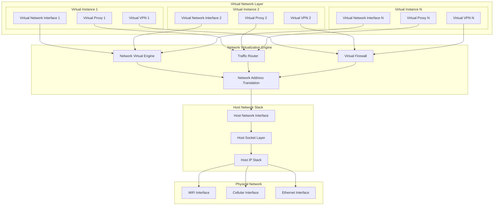
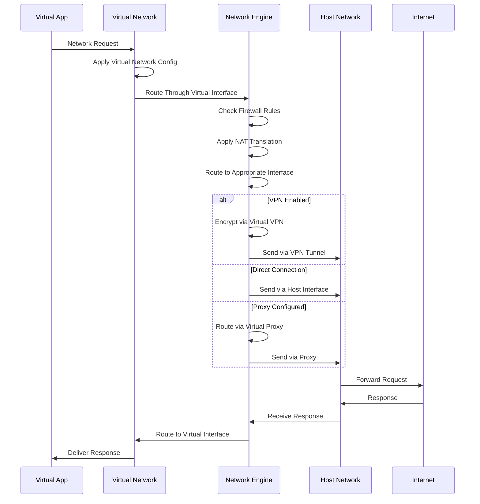

# RedBox Network Architecture

## Network Virtualization Stack

```mermaid
graph TB
    subgraph "Virtual Network Layer"
        subgraph "Virtual Instance 1"
            VN1[Virtual Network Interface 1]
            VP1[Virtual Proxy 1]
            VV1[Virtual VPN 1]
        end
        
        subgraph "Virtual Instance 2"
            VN2[Virtual Network Interface 2]
            VP2[Virtual Proxy 2]
            VV2[Virtual VPN 2]
        end
        
        subgraph "Virtual Instance N"
            VNN[Virtual Network Interface N]
            VPN[Virtual Proxy N]
            VVN[Virtual VPN N]
        end
    end
    
    subgraph "Network Virtualization Engine"
        NVE[Network Virtual Engine]
        TR[Traffic Router]
        FW[Virtual Firewall]
        NAT[Network Address Translation]
    end
    
    subgraph "Host Network Stack"
        HNI[Host Network Interface]
        HST[Host Socket Layer]
        HIP[Host IP Stack]
    end
    
    subgraph "Physical Network"
        WIFI[WiFi Interface]
        CELL[Cellular Interface]
        ETH[Ethernet Interface]
    end
    
    VN1 --> NVE
    VN2 --> NVE
    VNN --> NVE
    
    VP1 --> TR
    VP2 --> TR
    VPN --> TR
    
    VV1 --> FW
    VV2 --> FW
    VVN --> FW
    
    NVE --> NAT
    TR --> NAT
    FW --> NAT
    
    NAT --> HNI
    HNI --> HST
    HST --> HIP
    
    HIP --> WIFI
    HIP --> CELL
    HIP --> ETH
```

## Network Traffic Flow

```mermaid
sequenceDiagram
    participant VApp as Virtual App
    participant VNet as Virtual Network
    participant NetEngine as Network Engine
    participant HostNet as Host Network
    participant Internet as Internet
    
    VApp->>VNet: Network Request
    VNet->>VNet: Apply Virtual Network Config
    VNet->>NetEngine: Route Through Virtual Interface
    
    NetEngine->>NetEngine: Check Firewall Rules
    NetEngine->>NetEngine: Apply NAT Translation
    NetEngine->>NetEngine: Route to Appropriate Interface
    
    alt VPN Enabled
        NetEngine->>NetEngine: Encrypt via Virtual VPN
        NetEngine->>HostNet: Send via VPN Tunnel
    else Direct Connection
        NetEngine->>HostNet: Send via Host Interface
    else Proxy Configured
        NetEngine->>NetEngine: Route via Virtual Proxy
        NetEngine->>HostNet: Send via Proxy
    end
    
    HostNet->>Internet: Forward Request
    Internet->>HostNet: Response
    HostNet->>NetEngine: Receive Response
    NetEngine->>VNet: Route to Virtual Interface
    VNet->>VApp: Deliver Response
```