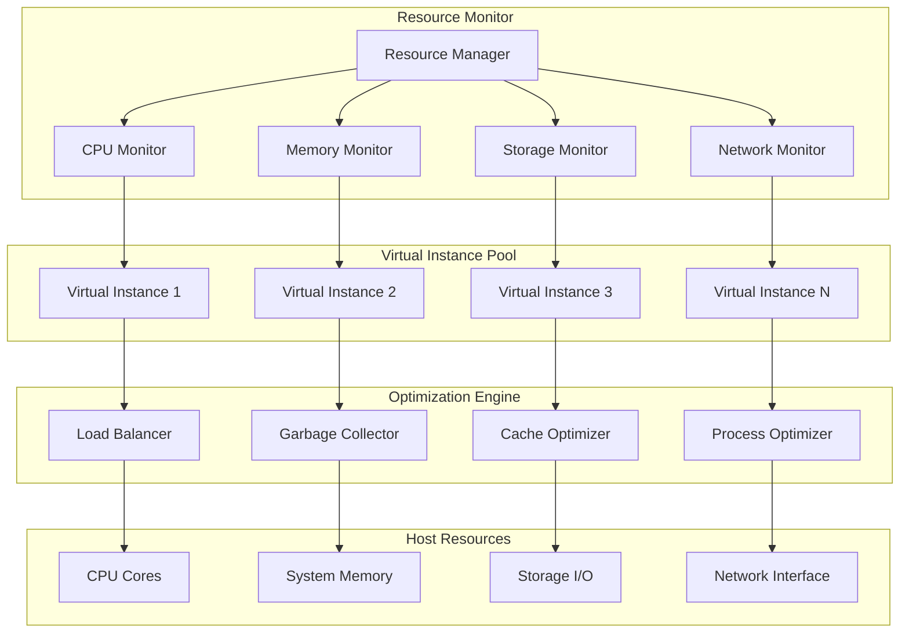

# RedBox Performance Architecture

## Resource Management Flow

```mermaid
graph TD
    subgraph "Resource Monitor"
        RM[Resource Manager]
        CM[CPU Monitor]
        MM[Memory Monitor]
        SM[Storage Monitor]
        NM[Network Monitor]
    end
    
    subgraph "Virtual Instance Pool"
        VI1[Virtual Instance 1]
        VI2[Virtual Instance 2]
        VI3[Virtual Instance 3]
        VIN[Virtual Instance N]
    end
    
    subgraph "Optimization Engine"
        LB[Load Balancer]
        GC[Garbage Collector]
        CO[Cache Optimizer]
        PO[Process Optimizer]
    end
    
    subgraph "Host Resources"
        CPU[CPU Cores]
        RAM[System Memory]
        STOR[Storage I/O]
        NET[Network Interface]
    end
    
    RM --> CM
    RM --> MM
    RM --> SM
    RM --> NM
    
    CM --> VI1
    MM --> VI2
    SM --> VI3
    NM --> VIN
    
    VI1 --> LB
    VI2 --> GC
    VI3 --> CO
    VIN --> PO
    
    LB --> CPU
    GC --> RAM
    CO --> STOR
    PO --> NET
```

## Performance Optimization Pipeline

```mermaid
flowchart LR
    A[App Launch Request] --> B[Resource Assessment]
    B --> C{Resources Available?}
    
    C -->|Yes| D[Allocate Resources]
    C -->|No| E[Optimize Existing Instances]
    
    E --> F[Garbage Collection]
    F --> G[Memory Compression]
    G --> H[Process Suspension]
    H --> I[Cache Cleanup]
    I --> D
    
    D --> J[Initialize Virtual Environment]
    J --> K[Load App Components]
    K --> L[Apply Performance Tuning]
    L --> M[Monitor Runtime Performance]
    
    M --> N{Performance Degradation?}
    N -->|Yes| O[Dynamic Optimization]
    N -->|No| P[Continue Monitoring]
    
    O --> Q[CPU Throttling]
    Q --> R[Memory Reallocation]
    R --> S[I/O Prioritization]
    S --> P
    
    P --> M
```