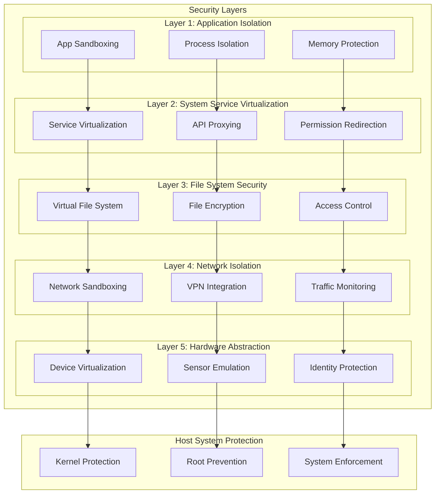
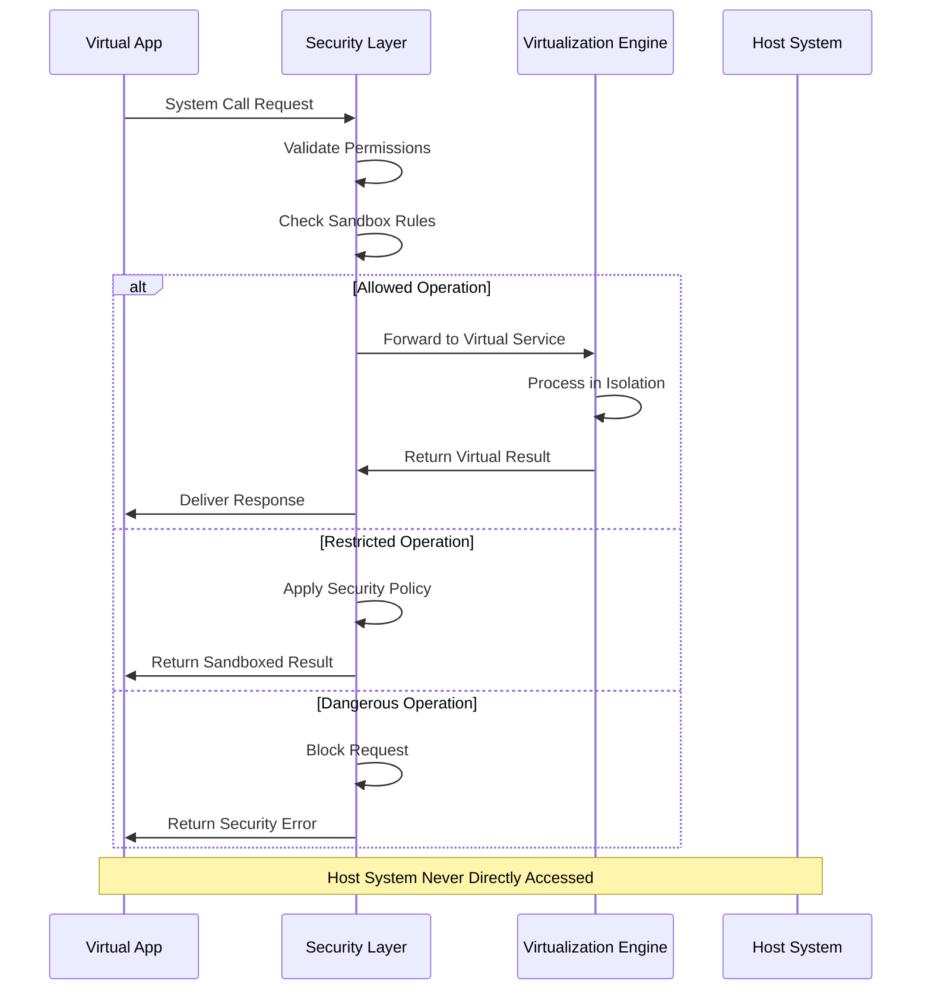

# RedBox Security Architecture

## Multi-Layer Security Model

```mermaid
graph TB
    subgraph "Security Layers"
        subgraph "Layer 1: Application Isolation"
            AI[App Sandboxing]
            PI[Process Isolation]
            MI[Memory Protection]
        end
        
        subgraph "Layer 2: System Service Virtualization"
            SV[Service Virtualization]
            AP[API Proxying]
            PR[Permission Redirection]
        end
        
        subgraph "Layer 3: File System Security"
            FS[Virtual File System]
            FE[File Encryption]
            AC[Access Control]
        end
        
        subgraph "Layer 4: Network Isolation"
            NI[Network Sandboxing]
            VI[VPN Integration]
            TM[Traffic Monitoring]
        end
        
        subgraph "Layer 5: Hardware Abstraction"
            DV[Device Virtualization]
            SN[Sensor Emulation]
            ID[Identity Protection]
        end
    end
    
    subgraph "Host System Protection"
        KP[Kernel Protection]
        RP[Root Prevention]
        SE[System Enforcement]
    end
    
    AI --> SV
    PI --> AP
    MI --> PR
    
    SV --> FS
    AP --> FE
    PR --> AC
    
    FS --> NI
    FE --> VI
    AC --> TM
    
    NI --> DV
    VI --> SN
    TM --> ID
    
    DV --> KP
    SN --> RP
    ID --> SE
```

## Security Flow Process

```mermaid
sequenceDiagram
    participant VApp as Virtual App
    participant SecLayer as Security Layer
    participant VirtEngine as Virtualization Engine
    participant HostSys as Host System
    
    VApp->>SecLayer: System Call Request
    SecLayer->>SecLayer: Validate Permissions
    SecLayer->>SecLayer: Check Sandbox Rules
    
    alt Allowed Operation
        SecLayer->>VirtEngine: Forward to Virtual Service
        VirtEngine->>VirtEngine: Process in Isolation
        VirtEngine->>SecLayer: Return Virtual Result
        SecLayer->>VApp: Deliver Response
    else Restricted Operation
        SecLayer->>SecLayer: Apply Security Policy
        SecLayer->>VApp: Return Sandboxed Result
    else Dangerous Operation
        SecLayer->>SecLayer: Block Request
        SecLayer->>VApp: Return Security Error
    end
    
    Note over VApp,HostSys: Host System Never Directly Accessed
```