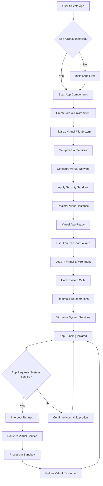
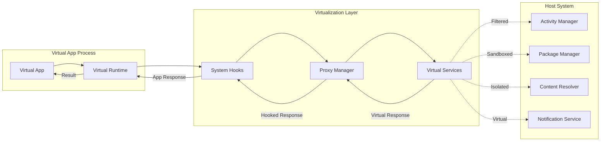

# RedBox Virtualization Flow

## App Virtualization Process

```mermaid
flowchart TD
    A[User Selects App] --> B{App Already Installed?}
    B -->|Yes| C[Scan App Components]
    B -->|No| D[Install App First]
    D --> C
    
    C --> E[Create Virtual Environment]
    E --> F[Initialize Virtual File System]
    F --> G[Setup Virtual Services]
    G --> H[Configure Virtual Network]
    H --> I[Apply Security Sandbox]
    I --> J[Register Virtual Instance]
    J --> K[Virtual App Ready]
    
    K --> L[User Launches Virtual App]
    L --> M[Load in Virtual Environment]
    M --> N[Hook System Calls]
    N --> O[Redirect File Operations]
    O --> P[Virtualize System Services]
    P --> Q[App Running Isolated]
    
    Q --> R{App Requests System Service?}
    R -->|Yes| S[Intercept Request]
    S --> T[Route to Virtual Service]
    T --> U[Process in Sandbox]
    U --> V[Return Virtual Response]
    V --> Q
    R -->|No| W[Continue Normal Execution]
    W --> Q
```

## System Service Virtualization

```mermaid
graph LR
    subgraph "Virtual App Process"
        VA[Virtual App]
        VR[Virtual Runtime]
    end
    
    subgraph "Virtualization Layer"
        SH[System Hooks]
        PM[Proxy Manager]
        VS[Virtual Services]
    end
    
    subgraph "Host System"
        AS[Activity Manager]
        PS[Package Manager]
        CS[Content Resolver]
        NS[Notification Service]
    end
    
    VA --> VR
    VR --> SH
    SH --> PM
    PM --> VS
    
    VS -.->|Filtered| AS
    VS -.->|Sandboxed| PS
    VS -.->|Isolated| CS
    VS -.->|Virtual| NS
    
    VS --> |Virtual Response| PM
    PM --> |Hooked Response| SH
    SH --> |App Response| VR
    VR --> |Result| VA
```